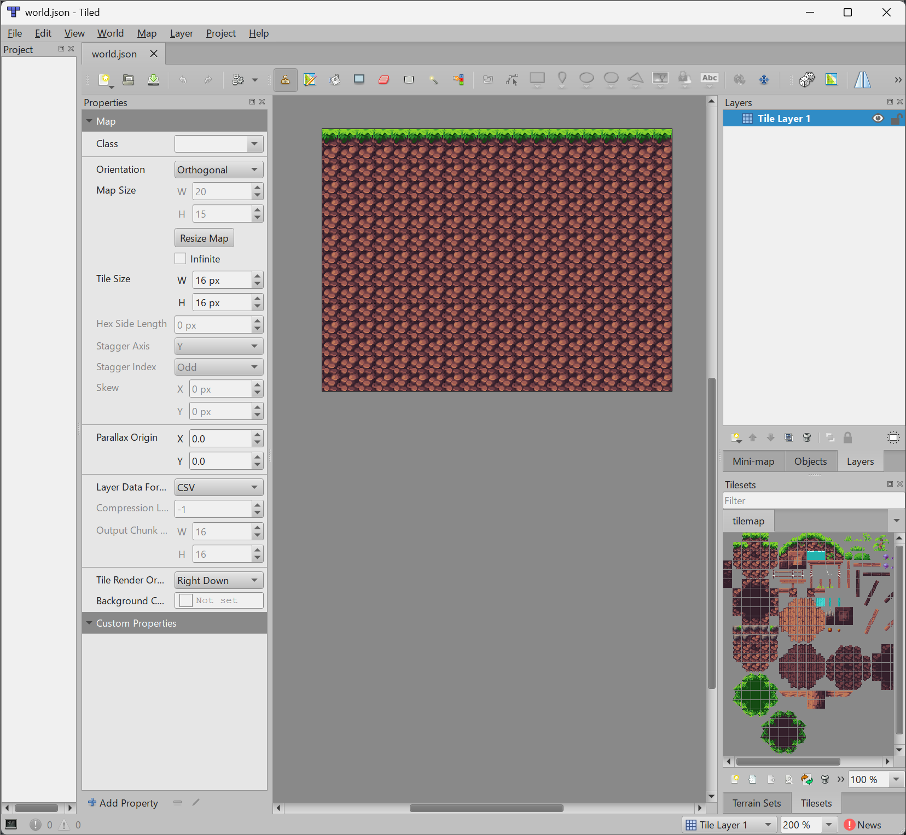
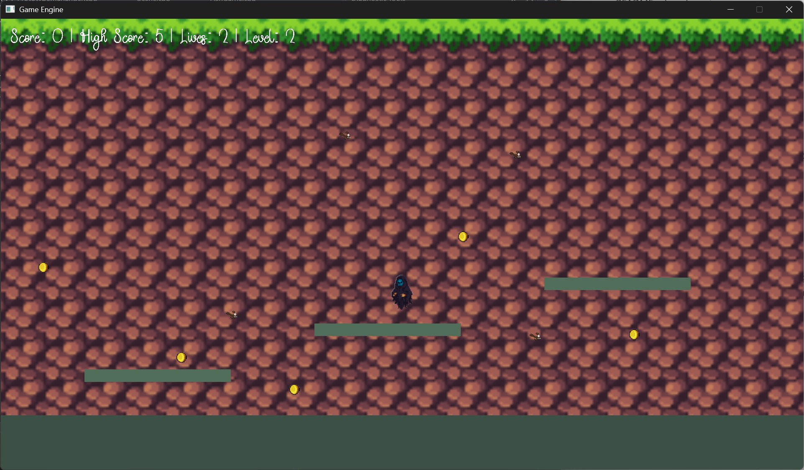

# Game Engine + Space Adventure

A component-based 2D game engine built in C++ with SDL3, along with **Space Adventure**, a top-down arcade shooter built to demonstrate the engine's core systems.

## About

This project was built for C++ Programming II as a final course project. It includes a custom 2D engine (rendering, audio, input, physics, tilemaps, resource management, scene management) alongside a playable game that exercises those systems: pilot a ship around an open arena, shoot down waves of enemies that hunt you down, survive escalating levels, and chase a persistent high score.

## Engine Features

- **Rendering** — static sprites and frame-based sprite animation (`SpriteRendererComponent`, `SpriteAnimationRendererComponent`), plus a particle system for explosion/trail effects
- **Audio** — sound effect and background music playback via a dedicated `Audio` system
- **Input** — full keyboard control scheme
- **Physics & Collision** — a lightweight circle-based collision system driving actual gameplay (player/enemy/bullet collisions), plus a box2d integration used to generate static collision bodies from tilemap data
- **Tile map–based world** — loads Tiled (`.json`) map exports, renders one or more tile layers, and scales to fill the screen
- **Scene management** — add/retrieve/remove actors through a central `Scene`
- **Resource loading** — a caching `ResourceManager` for textures and fonts, so repeated loads of the same asset reuse a single resource
- **Component-based actors** — gameplay behavior (`PlayerComponent`, `EnemyAIComponent`, `BulletComponent`, `RigidBodyComponent`) attached modularly to plain `Actor` objects

## Gameplay Features

- Controllable player ship with rotation, thrust-style movement, and shooting
- Enemies that actively hunt the player, including a faster enemy variant introduced at higher levels
- Score, lives, and level tracking with a persistent on-disk high score
- Title screen, in-level start countdown, active gameplay, and game-over states, with restart support
- Escalating difficulty — each level spawns more enemies at higher speed, mixing in fast enemies after level 2
- Particle-based explosions on enemy kills and player hits, plus a continuous engine trail while the player moves
- Brief player invincibility after taking a hit, so death isn't instant on contact

## Controls

| Key | Action |
|---|---|
| `W` / `A` / `S` / `D` | Move |
| `Left Arrow` / `Right Arrow` | Rotate ship |
| `Space` | Fire |
| `Enter` | Start / Restart |
| `Esc` | Quit |
| `1`–`5` | Play individual sound effects (debug) |

## Screenshots

### Gameplay

### Tiled Map Editor

## Building & Running

1. Clone the repository.
2. Open the solution in Visual Studio (x64, Debug or Release configuration).
3. Build the `Game_Engine` solution — this builds the engine library and the `FishGame` executable.
4. Run `Game.exe` from `Binaries/x64/<Debug|Release>/`. The working directory is set automatically to the `FishGame` assets folder at startup.

## Known Issues & Limitations

- The engine's `Factory` system is used to create player and enemy actors at runtime.
- Scene and actor serialization is used by the game to load actor prototypes and instantiate player and enemy bullet actors at runtime.
- No major known issues at this time.
- Mouse input is supported by the engine's `Input` system but is not currently used by the game.

## Credits

- Built with [SDL3](https://www.libsdl.org/) for windowing, rendering, and input
- [box2d](https://box2d.org/) for physics simulation
- [rapidjson](https://rapidjson.org/) for JSON/Tiled map parsing
- Maps created with the [Tiled Map Editor](https://www.mapeditor.org/)
- Art and audio assets sourced from free/open game asset packs (see `Assets/FishGame/Textures` and `Assets/FishGame/Audio`)
